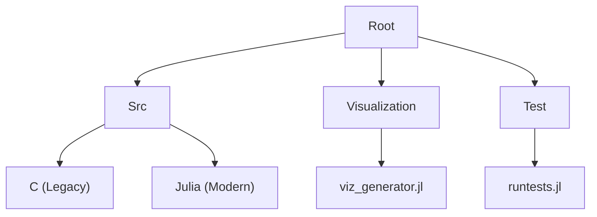
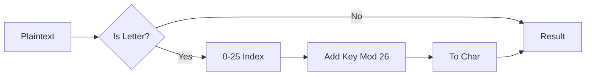

# Classic Ciphers Suite

A collection of classic cryptographic algorithms implemented in **C** (for historical context) and **Julia** (modern, high-performance implementation).

## Repository Structure


```
.
├── src/
│   ├── c/          # Original C implementations (requires CS50 library)
│   └── julia/      # Modern Julia implementations (Self-contained)
├── Makefile        # Build system for C and helper for Julia
└── README.md       # Documentation
```

## Quick Start (Julia)

Prerequisite: [Install Julia](https://julialang.org/downloads/)

### 1. Caesar Cipher
```bash
# Encrypt
julia src/julia/caesar.jl 5
# Type message + Enter
```

### 2. Vigenère Cipher
```bash
# Encrypt
julia src/julia/vigenere.jl KEYWORD
# Type message + Enter
```

### 3. Cryptanalysis (Break Caesar)
```bash
julia src/julia/caesar_break.jl
# Paste ciphertext
```

---

## Mathematical Foundations

### Logic Flow



### Modular Arithmetic
The core of these ciphers is modular arithmetic within the integer ring $\mathbb{Z}_{26}$. We map letters $A \dots Z$ to $0 \dots 25$.

#### Caesar Cipher Encryption
For a plaintext letter $P$ and key $K$:
$$ C = (P + K) \pmod{26} $$

#### Caesar Cipher Decryption
$$ P = (C - K) \pmod{26} $$

#### Vigenère Cipher
For the $i$-th character of plaintext $P_i$ and the key stream $K$:
$$ C_i = (P_i + K_{i \pmod{L}}) \pmod{26} $$
where $L$ is the length of the keyword.

### Cryptanalysis: Frequency Analysis

To break basic substitution ciphers, we utilize the fact that letter frequencies in natural languages are not uniform. In English, 'E' appears ~12.7% of the time, while 'Z' appears ~0.1%.

#### Chi-Squared Statistic
We quantify the "closeness" of a decrypted text to English using the Chi-Squared ($\chi^2$) statistic:

$$ \chi^2 = \sum_{i=A}^{Z} \frac{(O_i - E_i)^2}{E_i} $$

Where:
*   $O_i$ is the observed count of letter $i$ in the ciphertext.
*   $E_i$ is the expected count ($TotalLetters \times P(i)$).

The shift (key) that produces the decoded text with the **lowest** $\chi^2$ score is the most likely candidate.

---

## Legacy C Usage

If you have the CS50 library installed:

```bash
make caesar
./src/c/caesar 5
```

## Visualization uses Chart.js

We provide a tool to generate detailed HTML/JS frequency charts.

```bash
julia visualization/viz_generator.jl
# Paste text, then open 'visualization/frequency_chart.html' in your browser.
```

## Testing

To run the unit tests for the Julia implementation:

```bash
julia test/runtests.jl
```
